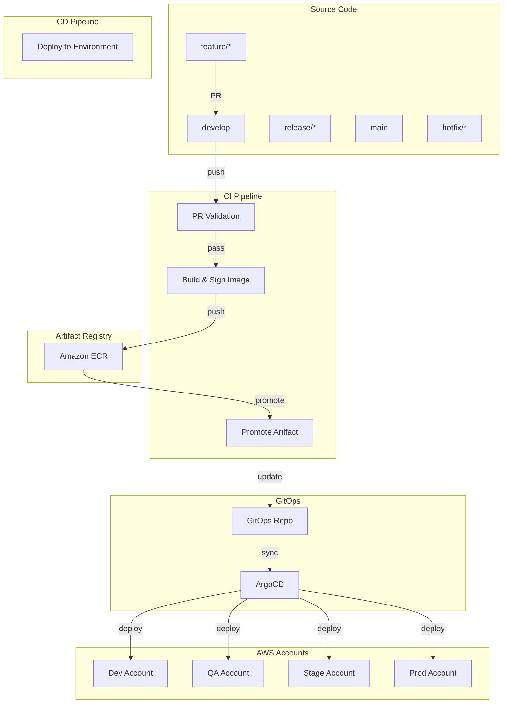
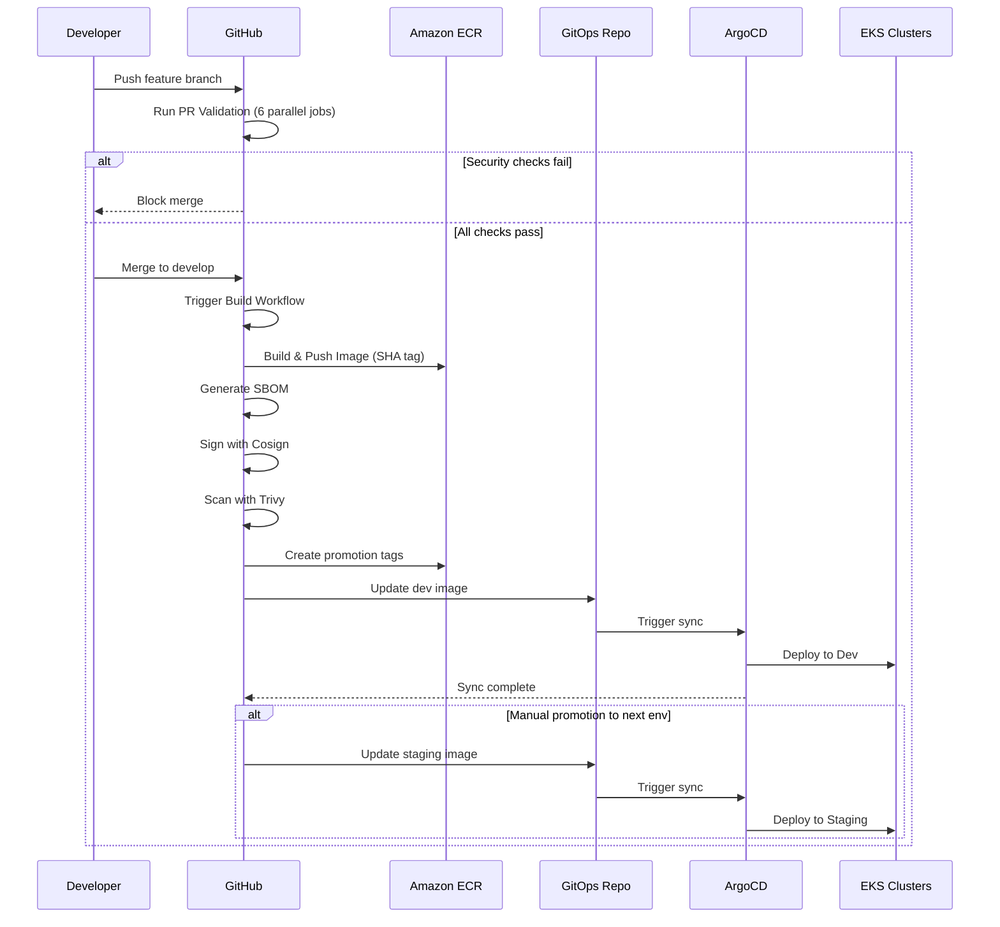

# Production-Grade DevSecOps CI/CD Architecture

This document outlines a production-ready CI/CD architecture for a Python-based microservice targeting Amazon EKS across a multi-account AWS environment. It incorporates modern DevSecOps practices, focusing on supply chain security, automation, and observability.

---

## Table of Contents
1. High-Level Architecture
2. Branching Strategy
3. Artifact Lifecycle
4. CI/CD Workflow Breakdown
5. GitHub Actions Workflows
6. AWS Authentication Design
7. Deployment & GitOps
8. Security Architecture
9. Environment Promotion Flow
10. Pipeline Diagram
11. Best Practices & Improvements

---

## 1. High-Level Architecture Diagram



---

## 2. Branching Strategy: GitLab Flow Style

| Branch | Purpose | Protection Rules | Deployment |
| :--- | :--- | :--- | :--- |
| `feature/*` | Developer feature branches | PR to develop, 1 approval | None |
| `develop` | Integration branch | PR, 1 approval, CI pass | Auto-deploy to Dev |
| `release/*` | Stabilization/QA | PR to release, 1 approval | Auto-deploy to QA/Stage |
| `main` | Production branch | PR, 2 approvals, signed commits | Manual approval to Prod |
| `hotfix/*` | Emergency fixes | PR to main, 1 approval | Fast-track to Prod |

### Code Promotion Flow

```
feature/* ──PR──> develop ──push──> release/* ──PR──> main
                         │              │
                         v              v
                     [Build]       [Build]
                         │              │
                         v              v
                      Dev/QA        Stage/QA          Production
                      (auto)         (auto)           (manual)
```

---

## 3. Artifact Lifecycle: Build Once Deploy Everywhere

### Immutable Artifact Model

| Stage | Action | Description |
| :--- | :--- | :--- |
| **Build** | Create | Docker image built with Git SHA tag |
| **Sign** | Sign | Cosign signs image with AWS KMS |
| **Scan** | Verify | Trivy scans for vulnerabilities |
| **Store** | Push | Image pushed to ECR with tags |
| **Promote** | Tag | Immutable tags created for environments |
| **Deploy** | Use | Same image SHA deployed across environments |

### Image Tagging Strategy

```
# Build-time tags (immutable)
111111111111.dkr.ecr.eu-west-1.amazonaws.com/gist-api:{sha}          # Primary (immutable)
111111111111.dkr.ecr.eu-west-1.amazonaws.com/gist-api:latest        # Latest (mutable)

# Promotion tags (environment-specific)
111111111111.dkr.ecr.eu-west-1.amazonaws.com/gist-api:{sha}-dev     # Dev environment
111111111111.dkr.ecr.eu-west-1.amazonaws.com/gist-api:{sha}-qa      # QA environment
111111111111.dkr.ecr.eu-west-1.amazonaws.com/gist-api:{sha}-staging # Staging environment
111111111111.dkr.ecr.eu-west-1.amazonaws.com/gist-api:{sha}-prod    # Production environment
```

---

## 4. CI/CD Workflow Breakdown

### Multi-Workflow Architecture

The pipeline is broken into **4 separate workflows** for maintainability:

| Workflow File | Purpose | Trigger |
| :--- | :--- | :--- |
| `pr-validation.yml` | PR checks, tests, security scans | PR to develop/main/release/* |
| `build.yml` | Build, sign, scan image | Push to develop/release/*/main |
| `promote.yml` | Promote between environments | Manual only (auto to Dev) |
| `deploy.yml` | Deploy to Kubernetes | Manual workflow_dispatch |

### Job Dependencies

```
pr-validation.yml (parallel jobs)
├── lint-and-format
├── security-sast
├── secret-scan
├── dependency-scan
├── unit-tests
├── build-acceptance
└── container-scan
        │
        v
build.yml (sequential)
├── build-and-push
├── generate-sbom
├── sign-image
└── vuln-scan
        │
        v
promote.yml
├── validate-image
├── verify-signature
├── create-promotion-tag
└── update-gitops
        │
        v
deploy.yml (environment-specific)
├── deploy-dev (auto from develop)
├── deploy-qa (manual)
├── deploy-staging (manual)
└── deploy-production (manual)
```

---

## 5. GitHub Actions Workflow Examples

### Workflow 1: PR Validation

**File:** `.github/workflows/pr-validation.yml`

**Triggers:**
- PR opened/updated to `develop`, `main`, `release/*`

**Jobs (parallel for fast feedback):**
1. **lint-and-format**: Ruff, Flake8 checks
2. **security-sast**: Bandit SAST scan
3. **secret-scan**: Gitleaks secrets detection
4. **dependency-scan**: Safety, dependency SBOM
5. **unit-tests**: pytest with coverage (80% threshold)
6. **build-acceptance**: Docker build test (no push)
7. **container-scan**: Trivy vulnerability scan

**Fail-fast:** Pipeline fails immediately on security check failures.

### Workflow 2: Build & Sign Image

**File:** `.github/workflows/build.yml`

**Triggers:**
- Push to `develop`, `release/*`, `main`, `hotfix/*`
- Manual `workflow_dispatch`

**Jobs:**
1. **build-and-push**: Build Docker image, push to ECR with SHA tag
2. **generate-sbom**: Anchore Syft generates SPDX-JSON SBOM
3. **sign-image**: Cosign signs with AWS KMS key
4. **vuln-scan**: Trivy scans, uploads SARIF to GitHub Security
5. **create-tag**: Creates Git tag for releases

### Workflow 3: Promote Artifact

**File:** `.github/workflows/promote.yml`

**Triggers:**
- After `build.yml` completes
- Manual `workflow_dispatch`

**Jobs:**
1. **validate-image**: Verifies image exists in ECR
2. **verify-signature**: Cosign verifies image signature
3. **create-promotion-tag**: Creates environment-specific tags
4. **update-gitops**: Updates GitOps repository manifests

### Workflow 4: Deploy

**File:** `.github/workflows/deploy.yml`

**Triggers:**
- Repository dispatch from GitOps
- Manual `workflow_dispatch`

**Jobs:**
1. **deploy-dev**: Auto-deploy (no approval)
2. **deploy-qa**: Auto-deploy (no approval)
3. **deploy-staging**: Manual approval required
4. **deploy-production**: Manual approval required
5. **rollback**: Emergency rollback capability

---

## 6. AWS Authentication Design: OIDC Federation

### Trust Relationship

GitHub Actions uses **OIDC (OpenID Connect)** to assume AWS IAM roles without static credentials.

```json
{
  "Version": "2012-10-17",
  "Statement": [
    {
      "Effect": "Allow",
      "Principal": {
        "Federated": "arn:aws:iam::ACCOUNT_ID:oidc-provider/token.actions.githubusercontent.com"
      },
      "Action": "sts:AssumeRoleWithWebIdentity",
      "Condition": {
        "StringLike": {
          "token.actions.githubusercontent.com:sub": [
            "repo:org/repo:ref:refs/heads/develop",
            "repo:org/repo:ref:refs/heads/main",
            "repo:org/repo:ref:refs/heads/release/*"
          ]
        },
        "StringEquals": {
          "token.actions.githubusercontent.com:aud": "sts.amazonaws.com"
        }
      }
    }
  ]
}
```

### IAM Role Strategy

| Account | Role | Permissions | Used By |
| :--- | :--- | :--- | :--- |
| Shared Services | `github-actions-ecr-push` | ECR push, KMS sign | build.yml |
| Dev | `github-actions-eks-deploy` | EKS access, kubectl | deploy-dev |
| QA | `github-actions-eks-deploy` | EKS access, kubectl | deploy-qa |
| Stage | `github-actions-eks-deploy` | EKS access, kubectl | deploy-staging |
| Prod | `github-actions-eks-deploy` | EKS access, kubectl | deploy-production |

---

## 7. Deployment & GitOps Workflow

### GitOps Architecture

```
GitHub Actions                    GitOps Repository
┌─────────────────────┐          ┌─────────────────────┐
│                     │          │                     │
│   Build & Sign      │──push───>│  environments/      │
│   Image             │          │  ├── dev/           │
│                     │          │  ├── qa/            │
└─────────────────────┘          │  ├── staging/       │
                                 │  └── production/    │
                                 └──────────┬──────────┘
                                            │
                                            │ pull
                                            v
                                 ┌─────────────────────┐
                                 │                     │
                                 │   ArgoCD            │
                                 │   (Kubernetes)      │
                                 │                     │
                                 └─────────────────────┘
```

### GitOps Repository Structure

```
gist-api-gitops/
├── base/
│   ├── kustomization.yaml
│   ├── deployment.yaml
│   ├── service.yaml
│   ├── ingress.yaml
│   └── hpa.yaml
├── overlays/
│   ├── dev/
│   │   ├── kustomization.yaml
│   │   └── image.yaml          # Points to :sha-dev tag
│   ├── qa/
│   │   ├── kustomization.yaml
│   │   └── image.yaml          # Points to :sha-qa tag
│   ├── staging/
│   │   ├── kustomization.yaml
│   │   └── image.yaml          # Points to :sha-staging tag
│   └── production/
│       ├── kustomization.yaml
│       └── image.yaml          # Points to :sha-prod tag
```

### Promotion Process

1. **Image Built**: SHA-based image pushed to ECR
2. **Promotion Triggered**: `promote.yml` creates environment tags
3. **GitOps Updated**: `image.yaml` updated with new tag
4. **ArgoCD Sync**: Detects change, applies to cluster
5. **Deployment**: Kubernetes rolls out new version

---

## 8. Security Architecture

### DevSecOps Pipeline

| Security Check | Tool | Stage | Action on Failure |
| :--- | :--- | :--- | :--- |
| Secrets Detection | Gitleaks | PR Validation | Block merge |
| SAST | Bandit | PR Validation | Block merge |
| Dependency Scan | Safety | PR Validation | Block merge |
| Container Build | Docker Buildx | Build | Fail build |
| Vulnerability Scan | Trivy | Build | Fail if CRITICAL |
| SBOM Generation | Anchore Syft | Build | Generate anyway |
| Image Signing | Cosign | Build | Block if unsigned |
| Image Verification | Cosign | Deploy | Block if invalid |

### Supply Chain Security

```
┌─────────────────────────────────────────────────────────────┐
│                    Supply Chain Security                     │
├─────────────────────────────────────────────────────────────┤
│                                                              │
│  Source ──> Build ──> Sign ──> Scan ──> Store ──> Deploy  │
│                                                              │
│  ┌──────────┐ ┌──────────┐ ┌──────────┐ ┌──────────┐     │
│  │  Gitleaks│ │Docker    │ │ Cosign   │ │  Trivy   │     │
│  │  Bandit  │ │Buildx    │ │ KMS      │ │  Syft    │     │
│  │  Safety  │ │          │ │          │ │          │     │
│  └──────────┘ └──────────┘ └──────────┘ └──────────┘     │
│                                                              │
│  Verification: Cosign verify at each stage                   │
│  SBOM: SPDX-JSON format, stored in GitHub artifacts         │
│                                                              │
└─────────────────────────────────────────────────────────────┘
```

---

## 9. Environment Promotion Flow

### Promotion Path

```
Dev ──> QA ──> Stage ──> Production
 │       │       │          │
 │       │       │          └─ Manual Approval
 │       │       └──────────── Manual Approval
 │       └──────────────────── Manual Approval
 └───────────────────────────── Auto (from develop branch)
```

### Environment-Specific Configuration

| Environment | Cluster | Strategy | Approval | Trigger |
| :--- | :--- | :--- | :--- | :--- |
| Dev | eks-dev-cluster | Rolling | None | Auto (push to develop) |
| QA | eks-qa-cluster | Rolling | Manual | workflow_dispatch |
| Stage | eks-staging-cluster | Blue-Green | Manual | workflow_dispatch |
| Production | eks-prod-cluster | Canary | Manual | workflow_dispatch |

### Canary Deployment

```
Production Deployment Flow (Canary):

1. Deploy 10% traffic ──────────────> ✓ Health check
2. Promote to 50% traffic ──────────> ✓ Metrics stable
3. Promote to 100% traffic ─────────> ✓ Full rollout

If at any stage:
- Error rate > 1% ──> Auto rollback
- Latency > 500ms ──> Auto rollback
```

---

## 10. Pipeline Flow Diagram



---

## 11. Best Practices & Improvements

### Security Best Practices

| Practice | Implementation | Why It Matters |
| :--- | :--- | :--- |
| OIDC Authentication | AWS_ROLE_ARN with web identity | No static credentials, secure |
| Image Signing | Cosign with AWS KMS | Verify image integrity |
| SBOM Generation | Anchore Syft | Know what's in your containers |
| Vulnerability Scanning | Trivy (CRITICAL/HIGH) | Prevent vulnerable deployments |
| Secrets Scanning | Gitleaks | Prevent secrets in code |
| Supply Chain | Sigstore, SLSA | Prevent tampering |

### Reliability Best Practices

| Practice | Implementation | Why It Matters |
| :--- | :--- | :--- |
| Immutable Artifacts | SHA-tagged images | Reproducible deployments |
| Canary Deployments | Progressive traffic shift | Safe rollouts |
| Auto Rollback | K8s rollout undo | Fast recovery from failures |
| Health Checks | Liveness/Readiness probes | Zero-downtime deployments |
| GitOps | ArgoCD declarative | Single source of truth |

### Operational Best Practices

| Practice | Implementation | Why It Matters |
| :--- | :--- | :--- |
| Parallel Jobs | PR validation runs in parallel | Fast feedback |
| Artifact Retention | 30-day cleanup | Cost savings |
| Concurrency Control | Cancel in-progress | Resource efficiency |
| Environment Protection | GitHub Environments | Controlled releases |
| Audit Logging | GitHub Actions logs | Compliance |

---

## Required GitHub Secrets

Configure these secrets in your repository:

| Secret | Description |
| :--- | :--- |
| `SHARED_SERVICES_ACCOUNT_ID` | AWS account for ECR |
| `DEV_ACCOUNT_ID` | Dev EKS AWS account ID |
| `QA_ACCOUNT_ID` | QA EKS AWS account ID |
| `STAGING_ACCOUNT_ID` | Stage EKS AWS account ID |
| `PROD_ACCOUNT_ID` | Prod EKS AWS account ID |
| `KMS_KEY_ARN` | Cosign AWS KMS key ARN |
| `GITOPS_REPO` | GitOps repository name |
| `GITOPS_TOKEN` | Token with write access to GitOps repo |

---

## GitHub Environment Configuration

### Production Environment Settings

1. **Settings** → **Environments** → **production**
2. Configure:
   - **Required reviewers**: 1-2 approvers
   - **Wait timer**: Optional (5-30 minutes)
   - **Deployment branch policy**: `main` branch only
   - **Environment secrets**: Environment-specific variables

### Environment URLs

| Environment | URL | Description |
| :--- | :--- | :--- |
| Development | https://dev.gist-api.example.com | Latest from develop |
| QA | https://qa.gist-api.example.com | Latest from release/* |
| Staging | https://staging.gist-api.example.com | Pre-production validation |
| Production | https://api.gist-api.example.com | Live production |

---

## Branch Protection Rules

Configure in **Settings** → **Branches** → **Add rule**:

| Branch | Rules |
| :--- | :--- |
| `main` | ✓ Require pull request, ✓ 2 approvals, ✓ Require signed commits, ✓ Require linear history |
| `develop` | ✓ Require pull request, ✓ 1 approval, ✓ Require status checks to pass |
| `release/*` | ✓ Require pull request, ✓ 1 approval, ✓ Auto-delete head branch |
| `hotfix/*` | ✓ Require pull request, ✓ 1 approval, ✓ Allow force push (emergency) |

---

*Document Version: 3.0* | *Last Updated: 2026-03-10* | *Pipeline Architecture: Multi-Workflow GitOps*
