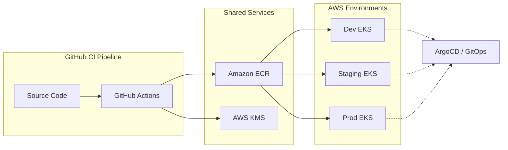

# Production-Grade DevSecOps CI/CD Architecture

This document outlines a production-ready CI/CD architecture for a Python-based microservice targeting Amazon EKS across a multi-account AWS environment. It incorporates modern DevSecOps practices, focusing on supply chain security, automation, and observability.

---

## 1. High-Level Architecture Diagram



---

## 2. Branching Strategy: GitFlow with Production Gates

We use a modified **GitFlow** model designed for frequent deployments and high stability.

| Branch | Purpose | Protection Rules | CI Trigger |
| :--- | :--- | :--- | :--- |
| `main` | Production-ready code. | Tagging required, 2 approvals, Linear history, Signed commits. | Deploy to Prod (Manual) |
| `release/*` | Staging/RC branch for final testing. | 1 approval, No direct commits. | Deploy to Staging (Auto) |
| `develop` | Integration branch for features. | 1 approval, Passing CI. | Deploy to Dev (Auto) |
| `feature/*` | Individual feature work. | Merge via PR to `develop`. | Build & Test Only |
| `hotfix/*` | Critical production fixes. | Merge to `main` and `develop`. | Deploy to Staging/Prod |

### Merge Rules & Protections
*   **Linear History Only**: No merge commits; squash and merge or rebase.
*   **Status Checks**: All lint, test, and security scans MUST pass before merging.
*   **CODEOWNERS**: Specific teams (Security, Platform) must approve changes to `Dockerfile`, `ci.yml`, and Helm charts.

---

## 3. Secure Dockerfile Example

A hardened, multi-stage Dockerfile designed for minimal attack surface and read-only environments.

```dockerfile
# Stage 1: Build & Dependencies
FROM python:3.12-slim AS builder

WORKDIR /app
ENV PYTHONDONTWRITEBYTECODE=1 \
    PYTHONUNBUFFERED=1

RUN apt-get update && apt-get install -y --no-install-recommends gcc python3-dev \
    && rm -rf /var/lib/apt/lists/*

RUN python -m venv /opt/venv
ENV PATH="/opt/venv/bin:$PATH"

COPY pyproject.toml .
RUN pip install --no-cache-dir .

# Stage 2: Final Production Image
FROM python:3.12-slim AS runtime

# Security Hardening: Create non-root user
RUN groupadd -g 10001 appgroup && \
    useradd -u 10001 -g appgroup -s /usr/sbin/nologin -M appuser

WORKDIR /app

# Copy only the virtualenv and source code
COPY --from=builder --chown=appuser:appgroup /opt/venv /opt/venv
COPY --chown=appuser:appgroup src/ /app/

# Environment configuration
ENV PATH="/opt/venv/bin:$PATH" \
    PORT=8080 \
    HOME=/tmp \
    LOG_LEVEL=INFO

# Drop all capabilities and restrict write access
USER appuser
EXPOSE 8080

# Read-only filesystem support
VOLUME ["/tmp"]

HEALTHCHECK --interval=30s --timeout=10s --start-period=5s --retries=3 \
    CMD ["python", "-c", "import urllib.request, sys; r = urllib.request.urlopen('http://localhost:8080/health'); sys.exit(0 if r.status == 200 else 1)"]

ENTRYPOINT ["uvicorn", "main:app", "--host", "0.0.0.0", "--port", "8080"]
```

---

## 4. CI Pipeline: Build, Scan, Sign, and Push

This workflow handles the high-governance secure delivery process.

```yaml
name: CI - Secure Build & Delivery

on:
  push:
    branches: [main, develop, 'release/*']
  pull_request:
    branches: [main, develop]

permissions:
  id-token: write # Required for OIDC AWS Auth
  contents: read
  security-events: write # Required for SARIF uploads

jobs:
  quality-gate:
    name: Code Quality & Security
    runs-on: ubuntu-latest
    steps:
      - uses: actions/checkout@v4
      - uses: actions/setup-python@v5
        with: { python-version: '3.12' }
      
      # 1. Dependency Analysis & Secrets Scan
      - name: Gitleaks Secrets Scan
        uses: gitleaks/gitleaks-action@v2
        env: { GITHUB_TOKEN: ${{ secrets.GITHUB_TOKEN }} }

      - name: Bandit SAST Scan
        run: pip install bandit && bandit -r src/

      # 2. Testing & Coverage
      - name: Run Unit & Integration Tests
        run: |
          pip install -e ".[dev]"
          pytest tests/ --cov=src --cov-report=xml --cov-fail-under=80

  build-and-deliver:
    name: Build, Scan & Sign
    needs: quality-gate
    if: github.event_name == 'push'
    runs-on: ubuntu-latest
    steps:
      - uses: actions/checkout@v4
      
      # 3. AWS OIDC Authentication (No Static Keys)
      - name: Configure AWS Credentials
        uses: aws-actions/configure-aws-credentials@v4
        with:
          role-to-assume: arn:aws:iam::${{ secrets.SHARED_SERVICES_ACCOUNT_ID }}:role/github-actions-ecr-push
          aws-region: eu-west-1

      - name: Login to Amazon ECR
        id: login-ecr
        uses: aws-actions/amazon-ecr-login@v2

      # 4. Multi-stage Docker Build
      - name: Docker Build & Push
        id: build-image
        uses: docker/build-push-action@v5
        with:
          context: .
          push: true
          tags: ${{ steps.login-ecr.outputs.registry }}/gist-api:${{ github.sha }}
          cache-from: type=gha
          cache-to: type=gha,mode=max

      # 5. Supply Chain Security: SBOM & Signing
      - name: Generate SBOM (Syft)
        uses: anchore/sbom-action@v0
        with:
          image: ${{ steps.login-ecr.outputs.registry }}/gist-api:${{ github.sha }}
          format: spdx-json
          output-file: sbom.json

      - name: Install Cosign
        uses: sigstore/cosign-installer@v3.4.0

      - name: Sign Docker Image (Cosign)
        run: |
          cosign sign --key aws-kms://${{ secrets.KMS_KEY_ARN }} \
          ${{ steps.login-ecr.outputs.registry }}/gist-api:${{ github.sha }}

      # 6. Vulnerability Scanning (Trivy)
      - name: Trivy Image Scan
        uses: aquasecurity/trivy-action@master
        with:
          image-ref: ${{ steps.login-ecr.outputs.registry }}/gist-api:${{ github.sha }}
          format: 'sarif'
          output: 'trivy-results.sarif'
          severity: 'CRITICAL,HIGH'
```

---

## 5. CD Pipeline: Multi-Account Helm Deployment

This pipeline assumes three AWS accounts (Dev, Staging, Prod), each with an EKS cluster.

```yaml
name: CD - Multi-Environment Deploy

on:
  workflow_run:
    workflows: ["CI - Secure Build & Delivery"]
    types: [completed]
    branches: [main, develop, 'release/*']

jobs:
  deploy-dev:
    if: github.event.workflow_run.conclusion == 'success' && github.ref == 'refs/heads/develop'
    runs-on: ubuntu-latest
    steps:
      - uses: actions/checkout@v4
      - name: Configure AWS (Dev Account)
        uses: aws-actions/configure-aws-credentials@v4
        with:
          role-to-assume: arn:aws:iam::${{ secrets.DEV_ACCOUNT_ID }}:role/github-actions-eks-deploy
          aws-region: eu-west-1
      
      - name: Helm Deploy
        run: |
          aws eks update-kubeconfig --name dev-cluster
          helm upgrade --install gist-api ./charts/gist-api \
            --namespace dev --create-namespace \
            --set image.tag=${{ github.sha }} \
            --values ./charts/gist-api/values-dev.yaml

  deploy-staging:
    if: github.event.workflow_run.conclusion == 'success' && startsWith(github.ref, 'refs/heads/release/')
    needs: deploy-dev
    runs-on: ubuntu-latest
    steps:
      - uses: actions/checkout@v4
      - name: Configure AWS (Staging Account)
        uses: aws-actions/configure-aws-credentials@v4
        with:
          role-to-assume: arn:aws:iam::${{ secrets.STAGING_ACCOUNT_ID }}:role/github-actions-eks-deploy
          aws-region: eu-west-1

      - name: Helm Deploy
        run: |
          aws eks update-kubeconfig --name staging-cluster
          helm upgrade --install gist-api ./charts/gist-api \
            --namespace staging --create-namespace \
            --set image.tag=${{ github.sha }}

  deploy-prod:
    if: github.event.workflow_run.conclusion == 'success' && github.ref == 'refs/heads/main'
    needs: deploy-staging
    runs-on: ubuntu-latest
    environment: production # Manual Approval Gate
    steps:
      - uses: actions/checkout@v4
      - name: Configure AWS (Prod Account)
        uses: aws-actions/configure-aws-credentials@v4
        with:
          role-to-assume: arn:aws:iam::${{ secrets.PROD_ACCOUNT_ID }}:role/github-actions-eks-deploy
          aws-region: eu-west-1

      - name: Helm Deploy (Canary)
        run: |
          aws eks update-kubeconfig --name prod-cluster
          helm upgrade --install gist-api ./charts/gist-api \
            --namespace production \
            --set image.tag=${{ github.sha }} \
            --set canary.enabled=true
```

---

## 6. Helm Chart Structure

Consistently structured for multi-environment overrides.

```text
charts/gist-api/
├── Chart.yaml                # Metadata
├── values.yaml               # Defaults (Production-like)
├── values-dev.yaml           # Dev overrides (min replicas, debug logs)
├── values-staging.yaml       # Staging overrides
└── templates/
    ├── deployment.yaml       # K8s Deployment with security context
    ├── service.yaml          # ClusterIP
    ├── ingress.yaml          # ALB/Nginx Ingress
    ├── hpa.yaml              # Horizontal Pod Autoscaler
    ├── pdb.yaml              # Pod Disruption Budget
    ├── secret.yaml           # ExternalSecrets / AWS Secrets Manager
    └── _helpers.tpl          # Common labels/tags
```

---

## 7. IAM Role Architecture for OIDC

We eliminate long-lived secrets by using **GitHub OIDC Trust**.

### Trust Relationship (Terraform/CloudFormation)
```json
{
  "Version": "2012-10-17",
  "Statement": [
    {
      "Effect": "Allow",
      "Principal": { "Federated": "arn:aws:iam::<ACCOUNT_ID>:oidc-provider/token.actions.githubusercontent.com" },
      "Action": "sts:AssumeRoleWithWebIdentity",
      "Condition": {
        "StringLike": {
          "token.actions.githubusercontent.com:sub": "repo:org/repo:ref:refs/heads/*"
        }
      }
    }
  ]
}
```

---

## 8. GitOps with ArgoCD

While GitHub Actions handles the **CI (Push)**, we recommend **ArgoCD** for **CD (Pull)** to ensure architectural drift is prevented.

*   **App-of-Apps Pattern**: Manage multiple clusters from a single controlplane.
*   **Automated Sync**: ArgoCD monitors the Helm repository or Git branch and automatically reconciles the EKS cluster state.
*   **Self-Healing**: If a developer manually edits a Kubernetes resource, ArgoCD will revert the change to match Git.

---

## 9. Observability & Monitoring

A production service must be observable.

| Component | Tool Recommendation |
| :--- | :--- |
| **Metrics** | Prometheus + Grafana (Amazon Managed Prometheus) |
| **Tracing** | OpenTelemetry + AWS X-Ray |
| **Logging** | FluentBit -> CloudWatch Logs / ELK Stack |
| **Alerting** | Alertmanager -> Slack / PagerDuty |

**Best Practice**: Ensure all logs are structured (JSON) and include `trace_id` for cross-service request correlation.

---

## 10. DevSecOps Best Practices Checklist

- [ ] **Shift Left**: Run security scans (Bandit/Trivy) on developer machines via pre-commit hooks.
- [ ] **Zero Trust IAM**: Use OIDC for cloud provider authentication; No static IAM user keys.
- [ ] **Immutable Infrastructure**: Never SSH into pods; all changes must go through the CI/CD pipeline.
- [ ] **Supply Chain Integrity**: Sign images with Cosign and verify signatures in the EKS admission controller.
- [ ] **Least Privilege**: Pods must run as non-root with `allowPrivilegeEscalation: false`.
- [ ] **Automated Rollbacks**: Configure Helm or ArgoCD to automatically rollback on health check failure.
